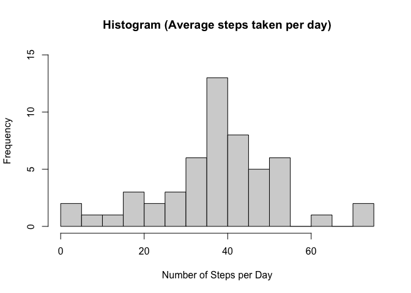
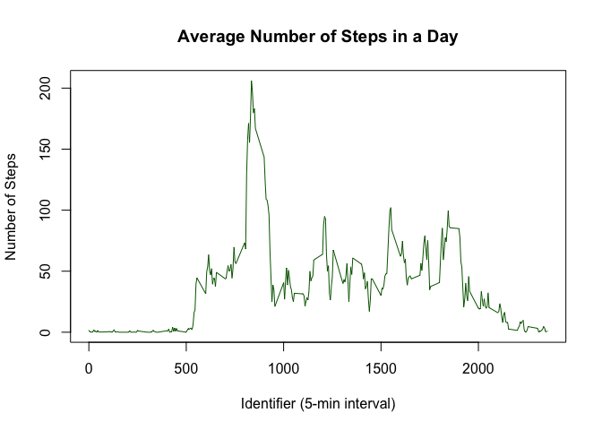
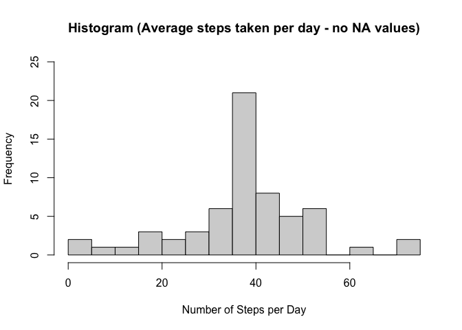
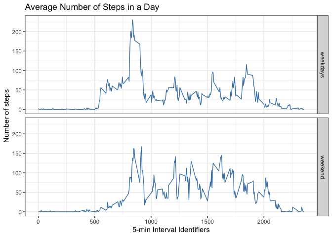

## A note to the reader
All files, figures and data for the analysis being done below can be found at my github repository at <https://github.com/hcfherminio/RepData_PeerAssessment1>.


## Loading and preprocessing the data
I am loading the dataset from a personal activity monitoring device. This device collects data at 5 minute intervals through out the day. The data consists of two months of data from an anonymous individual collected during the months of October and November, 2012 and include the number of steps taken in 5 minute intervals each day.

Lets first see how this dataset is by using a simple summary, as shown below:


```r
df<-read.csv(unz("activity.zip", "activity.csv"))#CSV file containing the data to be used
summary(df)#data summary
```

```
##      steps            date              interval     
##  Min.   :  0.00   Length:17568       Min.   :   0.0  
##  1st Qu.:  0.00   Class :character   1st Qu.: 588.8  
##  Median :  0.00   Mode  :character   Median :1177.5  
##  Mean   : 37.38                      Mean   :1177.5  
##  3rd Qu.: 12.00                      3rd Qu.:1766.2  
##  Max.   :806.00                      Max.   :2355.0  
##  NA's   :2304
```

We see that there are 3 variables: **steps**, **date** and **interval**. However, "date" still needs to be transformed from Character class to Date class variable, which I am doing below:


```r
library(dplyr,warn.conflicts=FALSE)#suppressing warning messages, just to make the final text clearer
df<-mutate(df,date=as.Date(date,"%Y-%m-%d"))#using dplyr to mutate the dataframe, ignoring time zone
summary(df)
```

```
##      steps             date               interval     
##  Min.   :  0.00   Min.   :2012-10-01   Min.   :   0.0  
##  1st Qu.:  0.00   1st Qu.:2012-10-16   1st Qu.: 588.8  
##  Median :  0.00   Median :2012-10-31   Median :1177.5  
##  Mean   : 37.38   Mean   :2012-10-31   Mean   :1177.5  
##  3rd Qu.: 12.00   3rd Qu.:2012-11-15   3rd Qu.:1766.2  
##  Max.   :806.00   Max.   :2012-11-30   Max.   :2355.0  
##  NA's   :2304
```

## What is mean total number of steps taken per day?

**Note:** I ignored missing data (coded as NA) when answering this question. See below.

First let us calculate the average of steps per day and see how they are distributed by plotting a histogram:


```r
stepmean<-aggregate(df$steps,by=list(df$date),FUN=mean)
#plotting the histogram using base system
with(stepmean,hist(x,xlab = "Number of Steps per Day",ylim = c(0,15),main = "Histogram (Average steps taken per day)",breaks = 12))
```

<!-- -->

As shown in the figure above, it seems that our data is very close to a normal distribution! That means that mean and median should be very similar! We can check that by calculating the mean and median as shown below:


```r
average_step<-round(mean(stepmean$x,na.rm=TRUE),2)#rounded average of steps per day
med_step<-round(median(stepmean$x,na.rm=TRUE),2)#rounded median
```

$\color{red}{\text{ANSWER:}}$ The average number of steps taken per day is approximately **37.38** steps and the median is approximately **37.38**.


## What is the average daily activity pattern?

In this section, I daily first estimated an average across all the days in the dataset for the number of steps and assigned the result in the variable called **dailycycle** using dplyr package (group_by and summarise) as shown below:

```r
# Suppress summarise info
options(dplyr.summarise.inform = FALSE)

dailycycle<-df%>%
        group_by(interval) %>%
        summarise(daily_avestep=mean(steps,na.rm = TRUE))        
```

The **dailycycle** is a tibble of size 288x2 containing the averaged number of steps for each 5 min interval. The plot below shows the resulting analysis. Note that there are 2335 5-min interval identifiers, which is far more than expected in a day (a day has 1440 minutes). This is because there are several NA values in the original dataset. 


```r
with(dailycycle,plot(interval,daily_avestep,type="l",lty=1,lwd=1,col="darkgreen",xlab = "Identifier (5-min interval)",ylab = "Number of Steps",main = "Average Number of Steps in a Day"))
```

<!-- -->

Lets now find the maximum number of steps in a average daily cycle.

```r
identifier<-as.numeric(dailycycle[which.max(dailycycle$daily_avestep),][1,1])
maxsteps<-round(as.numeric(dailycycle[which.max(dailycycle$daily_avestep),][1,2]),0)
```
$\color{red}{\text{ANSWER:}}$ The 5-min interval identifier that contains the maximum number of steps on average across all the days is equal to **835**, which corresponds to approximately **206** steps!.

## Imputing missing values

Let see how many NA are in the data. See below:


```r
count_step<-is.na(df$steps)
count_interval<-is.na(df$interval)
count_date<-is.na(df$date)
```
$\color{red}{\text{ANSWER:}}$ There is a total of **2304** rows with NA values in the original dataset, **2304** in **steps** variable, **0** in **date** variable and **0** in **interval** variable. The total amount of NA values represent about 13.1 % of the dataset.

Now,lets substitute them by the average number of steps taken at same 5-min interval and store this result on a new data frame called **filled_df**. See below:


```r
filled_df<-df
indx <- which(is.na(filled_df$steps), arr.ind = TRUE)#getting NA indexes

filled_df$steps[indx]<-dailycycle$daily_avestep[dailycycle$interval%in%filled_df$interval[indx]]
```

Lets now make the histogram of this correct dataset without NA values and see how the total number of steps per day is distributed.


```r
stepmean2<-aggregate(filled_df$steps,by=list(filled_df$date),FUN=mean)

average_step2<-round(mean(stepmean2$x),2)#rounded average of steps per day
med_step2<-round(median(stepmean2$x),2)#rounded median

#plotting the histogram using base system
with(stepmean2,hist(x,xlab = "Number of Steps per Day",ylim = c(0,25),main = "Histogram (Average steps taken per day - no NA values)",breaks = 12))
```

<!-- -->

$\color{red}{\text{ANSWER:}}$ The distribution does not seem to change much from the first histogram. The rounded mean and median are respectively **37.38** and **37.38**. These values are pretty much the same values we calculated when ignoring NA values, at least they are very close! In other words, substituting NA values had no impact.

## Are there differences in activity patterns between weekdays and weekends?

Lets first create a new factor column with the words **"weekend"** and **"weekdays"**. See below:


```r
filled_df <- filled_df %>%
             mutate(week=1*(weekdays(date)==
                    "Saturday"|weekdays(date)=="Sunday")+
                     0*(weekdays(date)!="Saturday" &  
                     weekdays(date)!="Sunday")) 
filled_df<-mutate(filled_df,week=as.factor(week))
levels(filled_df$week)<-c("weekdays","weekend")
```
Now, lets plot both (**weekdays** and **weekend**) time series and see how the average number of steps taken in a day differ between them. See below:


```r
dailycycle2<-filled_df%>%
            group_by(interval,week) %>%
            summarise(daily_avestep=mean(steps,na.rm = TRUE)) 

library(ggplot2,warn.conflicts = FALSE)
ggplot(dailycycle2,aes(interval,daily_avestep))+
      geom_line(color="steelblue")+ 
      facet_grid(week ~ .)+
      labs(x="5-min Interval Identifiers",y="Number of steps",
           title="Average Number of Steps in a Day")+
      theme_bw()
```

<!-- -->


